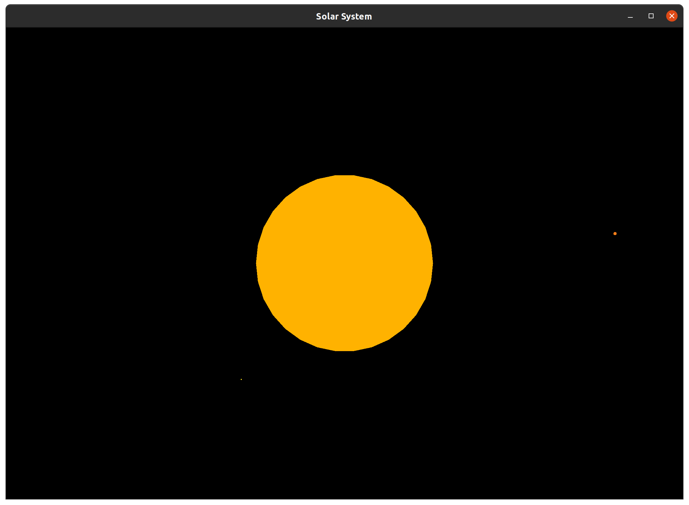

# OpenGL Solar System Simulation

This is an OpenGL application (specifically, Glut) that uses precise Newtonian
physics equations to compute and simulate gravitational pull of objects in the
solar system. Specifically, this uses known data of planetary coordinates,
velocities, and accelerations to seed the model, and simply calculates,
simulates, and displays the gravitational effects on the planets.

This was authored back while I was in high-school in 2011. The design of this
does *not* reflect the qualify of code or decisions that would be made if this
were to be done again from scratch. In particular, I wrote this more like a C
program than C++ program.

⚠️ _**This project is not maintained, and is only here for visibility**_

<sup>Honestly though, I had fun writing this.</sup>



## Controls

* <kbd>←</kbd>: Focuses the camera on the previous celestial body
* <kbd>→</kbd>: Changes camera on the next celestial body
* <kbd>↑</kbd>: Zooms in
* <kbd>↓</kbd>: Zooms out
* <kbd>q</kbd>: Speeds up the simulation
* <kbd>a</kbd>: Slows down the simulation

## Building

### Requirements

Make sure that you have OpenGL and Glut or FreeGlut libraries installed.

### Ubuntu

```bash
sudo apt install -y freeglut3-dev
```

### Windows (msys2 mingw)

```bash
# Assuming x86_64
pacman -S mingw-w64-x86_64-freeglut
```

## Build Steps

This project can be built with standard [CMake](https://cmake.org/)

```bash
mkdir build
cd build
cmake ..
cmake --build .
```

The resultant binary will be named `SolarSystem` (or `SolarSystem.exe` on
Windows)


## Known Issues

* The simulation is not frame-locked (adaptive or otherwise)meaning that the
  computation will go as fast as the underlying processor will compute it

* Scale factors are applied to the physics values themselves, which -- for
  smaller scales, is fine, but for larger scales will cause the planets to fly
  off into the great unknown.

* There are definitely more bugs than just this. Without a doubt.

## License

> The MIT License (MIT)
>
> Copyright (c) 2011 Matthew Rodusek
>
> Permission is hereby granted, free of charge, to any person obtaining a copy
> of this software and associated documentation files (the "Software"), to deal
> in the Software without restriction, including without limitation the rights
> to use, copy, modify, merge, publish, distribute, sublicense, and/or sell
> copies of the Software, and to permit persons to whom the Software is
> furnished to do so, subject to the following conditions:
>
> The above copyright notice and this permission notice shall be included in all
> copies or substantial portions of the Software.
>
> THE SOFTWARE IS PROVIDED "AS IS", WITHOUT WARRANTY OF ANY KIND, EXPRESS OR
> IMPLIED, INCLUDING BUT NOT LIMITED TO THE WARRANTIES OF MERCHANTABILITY,
> FITNESS FOR A PARTICULAR PURPOSE AND NONINFRINGEMENT. IN NO EVENT SHALL THE
> AUTHORS OR COPYRIGHT HOLDERS BE LIABLE FOR ANY CLAIM, DAMAGES OR OTHER
> LIABILITY, WHETHER IN AN ACTION OF CONTRACT, TORT OR OTHERWISE, ARISING FROM,
> OUT OF OR IN CONNECTION WITH THE SOFTWARE OR THE USE OR OTHER DEALINGS IN THE
> SOFTWARE.